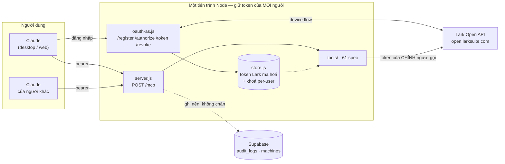
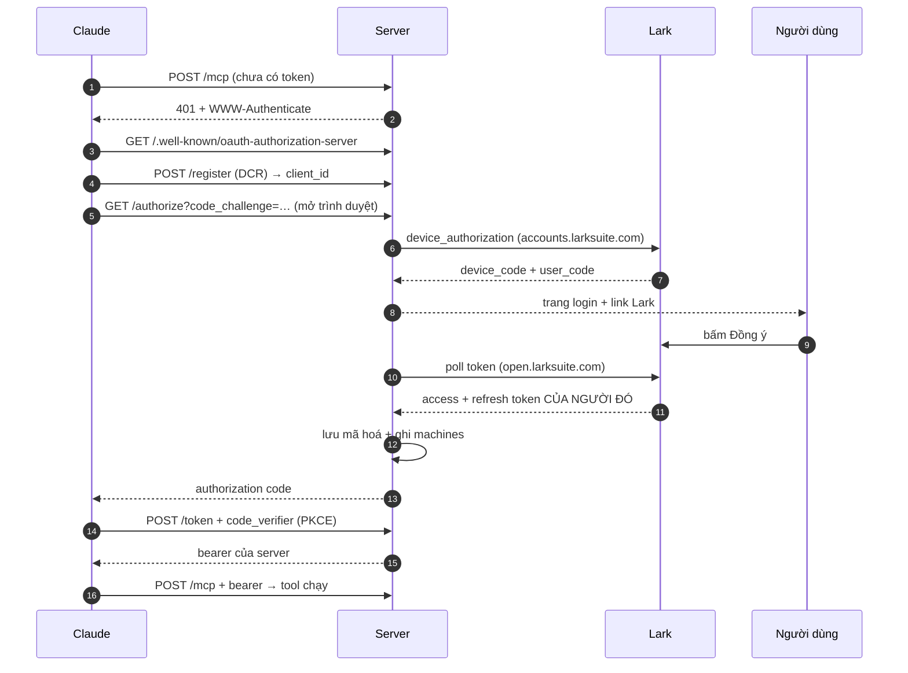
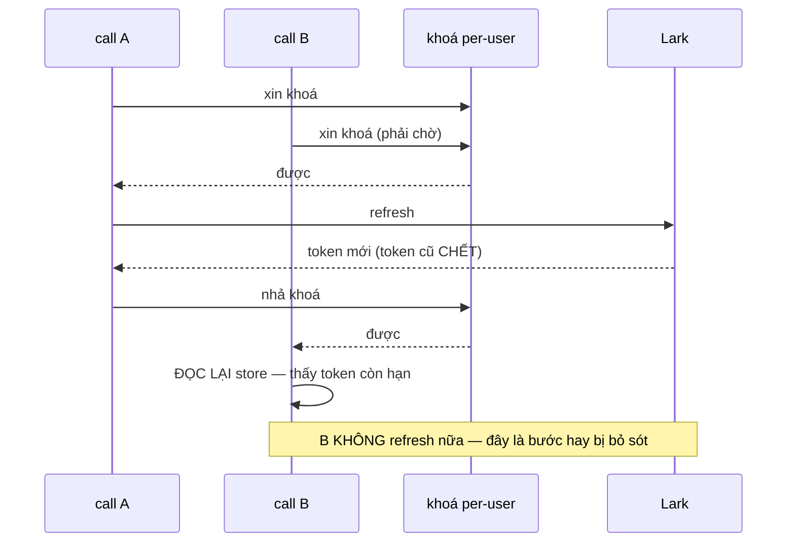
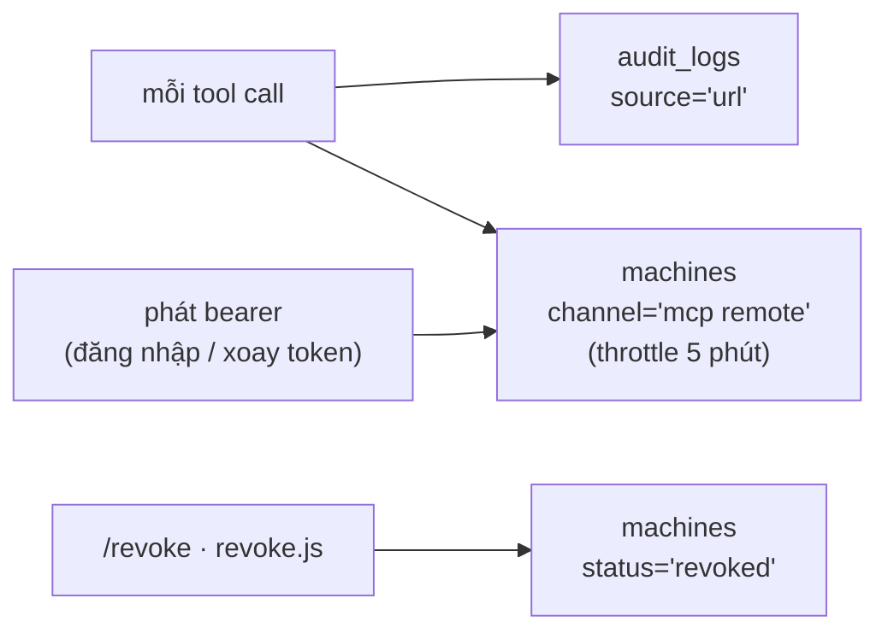

# Lark MCP v3 — tài liệu kỹ thuật

Một server, một URL, cả công ty dùng chung. Mỗi người đăng nhập Lark của mình và mọi tool chạy đúng dưới danh tính người gọi.

**61 tool · REST thuần, không lark-cli · OAuth 2.1 + PKCE · Node ≥ 22**

Đây không phải v2 đóng gói lại. v2 là CLI trên máy từng người: mỗi máy một profile, spawn `lark-cli`, audit ghi vào Bitable. v3 bỏ hết — gọi thẳng REST, không keychain, không profile, không spawn.

---

## 1. Kiến trúc



Khác v2 ở đúng hộp giữa: **một** tiến trình giữ token của mọi người, thay vì mỗi máy một bản cài.

### Vì sao stateless từng request

`POST /mcp` dựng `McpServer` + transport mới cho **mỗi** request rồi đóng lại. Tốn vài trăm micro giây, đổi lại không có biến nào sống xuyên qua hai user. v2 phải dùng `AsyncLocalStorage` để "chọn đúng profile"; v3 không cần vì chẳng có gì để chọn nhầm — danh tính đi kèm request và chết theo request.

---

## 2. Đăng nhập



Claude không biết gì về Lark. Nó nói OAuth với server này; server mới đi nói device flow với Lark.

**Vì sao device flow, không phải authorization code flow với Lark:** device flow chỉ cần `app_id` + `app_secret`, không phải khai báo redirect URI, nên không cần quyền vào Lark Developer Console.

### Hai tầng token, đừng nhầm

| | Ai giữ | Hạn | Khi hết hạn |
|---|---|---|---|
| **Bearer của server** | Claude | access 30 ngày, refresh 180 ngày | Claude tự gọi `/token` với `grant_type=refresh_token` |
| **Token Lark** | Server, mã hoá trên đĩa | access 2 giờ | Server tự refresh nhờ `offline_access` |

Server chỉ lưu **hash** của bearer — lộ file cũng không dùng lại được. Token Lark mã hoá AES-256-GCM bằng `TOKEN_ENC_KEY`.

---

## 3. Bẫy lớn nhất: refresh token của Lark dùng ĐÚNG MỘT LẦN

Claude bắn nhiều tool call song song. Hai call cùng thấy token hết hạn sẽ cùng đi refresh, cái thứ hai dùng lại token đã chết → **Lark thu hồi cả chuỗi**, user bị đăng xuất giữa chừng.



Bước "đọc lại trạng thái sau khi giành được khoá" là chỗ dễ bỏ sót nhất — thiếu nó thì có khoá cũng vô dụng.

**Hệ quả cho deploy:** khoá này là mutex *trong tiến trình* ([store.js](../src/store.js) · `withUserLock`). Chạy hai instance là hai mutex không biết nhau — quay lại đúng kịch bản trên. Muốn scale ngang thì phải chuyển token store sang Supabase với khoá ở DB **trước**.

Test: `npm run test:race`.

---

## 4. Mã nguồn

```
hapas-lark-remote/
├─ supervisor.js          điểm khởi động thật: tunnel → server → tự bật lại khi chết
├─ revoke.js              thu hồi truy cập từ phía quản trị (npm run revoke)
├─ start-server.bat       mở console nhìn thấy được (đóng cửa sổ = tắt server)
├─ install-autostart.ps1  đăng ký chạy khi đăng nhập Windows
│
├─ src/
│  ├─ server.js           Express: /mcp, /health, /files/:id, gắn OAuth router
│  ├─ oauth-as.js         OAuth 2.1 AS: DCR, /authorize, /token, /revoke, PKCE
│  ├─ lark-auth.js        device flow với Lark + getValidAccessToken (qua khoá)
│  ├─ lark.js             larkApi/fetchRetry, stripInstructions, bot token
│  ├─ store.js            token store mã hoá + withUserLock  ← đổi sang DB thì sửa ở đây
│  ├─ supabase.js         URL + service key + sbFetch, dùng chung
│  ├─ audit.js            gom lô, bắn nền, tự bỏ cột schema chưa có + auditAuth
│  ├─ machines.js         ghi danh tính người dùng remote vào bảng machines
│  ├─ canary.js           9 probe đọc + 3 probe ghi mỗi giờ, DM khi hỏng
│  ├─ canary-write.js     probe ghi: ghi → đọc lại đối chiếu → dọn sạch
│  ├─ keepalive.js        xoay token 12h/lượt để phiên Lark không rụng sau 7 ngày
│  ├─ notify.js           DM cảnh báo cho quản trị, dùng chung canary + keepalive
│  ├─ files.js            tool xuất file → trả link tải, không phải đường dẫn ổ đĩa
│  ├─ config.js           đọc .env, chọn host theo LARK_DOMAIN, version từ package.json
│  └─ tools/
│     ├─ index.js         gom spec, chặn trùng tên + tool chưa phân loại
│     ├─ registry.js      spec → tool MCP; execSpec dùng chung với canary
│     ├─ hints.js         đọc / tạo mới / phá — quyết định client có hỏi lại không
│     └─ specs/           core · docs · office · base · work   ← thêm tool ở đây
│
├─ test/
│  ├─ e2e.js              đúng luồng Claude: register → authorize → token → gọi tool
│  ├─ refresh-race.js     ép token hết hạn + nhiều call ập vào cùng lúc
│  └─ parity-check.js     đối chiếu bộ tool với bản zip
│
├─ supabase/
│  ├─ audit-source.sql    cột source ('zip' | 'url') cho audit_logs
│  └─ machines-remote.sql cột user_id + channel='mcp remote' cho machines
└─ docs/technical.md      (file này)
```

### Tool là dữ liệu, không phải code

Thêm một tool = thêm một object vào file spec. Chỉ khi cần **nhiều hơn một** REST call mới phải viết `handler`.

```js
{
  name: 'calendar_agenda',
  desc: '[CALENDAR] Xem lịch họp của bạn trong khoảng thời gian.',
  schema: {
    start_time: z.string().describe('Unix timestamp giây'),
    end_time:   z.string().describe('Unix timestamp giây'),
  },
  method: 'GET',
  path:   '/open-apis/calendar/v4/calendars/primary/events/instance_view',
  query:  ['start_time', 'end_time'],
}
```

Endpoint bóc từ `lark-cli <shortcut> --dry-run` của bản zip. **Đây là oracle duy nhất đáng tin** — xem mục 7. Thêm tool xong chạy `npm run parity`.

### Phân loại tool — vì sao client hỏi lại mãi

Mỗi tool phải nằm trong đúng một nhóm ở [hints.js](../src/tools/hints.js): **đọc 35 · tạo mới 14 · phá/gửi 12**. Nhóm này thành `annotations.readOnlyHint` / `destructiveHint` trong `tools/list`. Không khai thì client buộc phải coi mọi tool là có thể sửa dữ liệu và hỏi xác nhận từng cái — kể cả 35 tool chỉ đọc.

**Không suy ra từ HTTP method được.** Lark dùng POST cho rất nhiều API tìm kiếm (`contact_search_user`, `drive_search`, `minutes_search`, `vc_search`). Suy theo method sẽ gắn nhãn "ghi" cho cả loạt tool đọc. `assertClassified()` ném lỗi lúc khởi động nếu có tool chưa xếp nhóm.

---

## 5. Vận hành

| Thành phần | Cơ chế | Hỏng thì sao |
|---|---|---|
| URL công khai | Tailscale Funnel, trong dịch vụ `tailscaled` | Tự sống qua reboot; supervisor không nuôi tiến trình tunnel nào |
| Server | `supervisor.js` bật lại, backoff tăng dần | Chạy ổn > 2 phút thì reset bộ đếm — coi lần chết đó là sự cố lẻ |
| Sau reboot | Startup folder chạy `start-server.bat` | Chỉ chạy khi **đăng nhập** Windows, không phải khi bật máy |
| Nhịp tim | 5 phút/lần: `/health` + đối chiếu funnel status | Funnel trỏ sai tên thì tự reset và dựng lại |

`/health` xanh **không** có nghĩa người ngoài vào được. Đã dính đúng thế khi đổi tên máy Tailscale: hostname đổi nhưng serve config vẫn ghim tên cũ — server báo sống trong khi URL công khai đã chết. Nhịp tim vì vậy phải kiểm cả hai.

### Ba thứ ghi vào Supabase



**audit_logs** — chung bảng với client zip, phân biệt bằng `source`. Gom lô 25 bản ghi hoặc 5 giây, bắn nền: tool call không bao giờ chờ audit, và audit chết thì tool vẫn chạy.

> **Thiếu cột thì bỏ cột, đừng bỏ cả lô.** PostgREST từ chối nguyên lô khi payload có cột bảng chưa có. Đã mất trắng 100% log của bản remote vì thiếu mỗi `error_msg` — nhìn bên ngoài vẫn tưởng đang ghi bình thường. Giờ `flush()` đọc tên cột trong thông báo lỗi, bỏ đúng cột đó rồi gửi lại, và quên sau 30 phút để tự phục hồi khi migration đã chạy. [machines.js](../src/machines.js) làm y hệt cho `user_id` và `channel`.

**machines** — mỗi dòng là một cặp *(người, chỗ cắm)*, `machine_id = 'url-' + sha256(openId|clientId)`. Server chỉ nhận HTTP request nên **không** biết máy của người gọi: `hostname`/`os` để NULL thật thà. Thu hồi thì đặt `status='revoked'`, **không xoá dòng** — mất `installed_at` là mất lịch sử "ai từng cắm cái gì, từ khi nào".

```sql
-- người dùng bản remote
select user_id, username, status, last_seen
from machines where channel = 'mcp remote' order by last_seen desc;
```

### Canary

Mỗi 60 phút, dưới danh nghĩa `CANARY_OPEN_ID`: **9 probe đọc + 3 probe ghi**. Hỏng 2 lần liên tiếp mới DM, và báo đúng một lần cho mỗi lần hỏng — cảnh báo lặp là thứ khiến người ta tắt thông báo rồi bỏ lỡ lần sau.

Vì sao cần khi đã có audit của traffic thật: audit chỉ nói được về tool **đang có người gọi**. Tool ít dùng mới là chỗ hỏng âm thầm hàng tháng.

Probe ghi ([canary-write.js](../src/canary-write.js)) chạy trên một khu nháp cố định (base/sheet/docx dựng một lần, token nhớ trong `canary.json`) và có hai nguyên tắc:

- **Ghi xong phải ĐỌC LẠI ĐỐI CHIẾU.** `code: 0` mà dữ liệu sai kiểu là chuyện đã xảy ra thật — probe sheets so kiểu của số và bool đọc lại được, không chỉ xem call có lỗi hay không.
- **Tự dọn sạch.** Canary chạy mỗi giờ mãi mãi; để lại một dòng rác là sau một năm có 8760 dòng.

Chưa có probe cho `task_create`: app thiếu scope `task:task:delete` nên tạo xong không xoá được. `CANARY_WRITE=0` để tắt nhóm ghi.

```sql
-- tool nào bắt đầu lỗi trong 7 ngày qua
select tool_name, lark_code, count(*)
from audit_logs
where source = 'url' and ok = false and created_at > now() - interval '7 days'
group by 1, 2 order by 3 desc;
```

`99991663` là user thiếu quyền — chuyện thường ngày. **404 hoặc lỗi tham số** mới là dấu hiệu Lark đổi API.

### Keepalive

Refresh token của Lark là **cửa sổ trượt**: mỗi lần xoay, Lark cấp phiếu mới với hạn 7 ngày trọn vẹn. Đo trên dữ liệu thật (`refreshExpiresAt` luôn cách `updatedAt` đúng 168h, kể cả ở tài khoản đã xoay token hàng chục lần) chứ không đoán theo tài liệu. Nên chỉ cần chạm vào một lần trong 7 ngày là phiên sống mãi.

[keepalive.js](../src/keepalive.js) làm đúng việc đó cho **mọi** người, mỗi 12 tiếng, một request tới token endpoint cho mỗi người. Trước đó chỉ tài khoản `CANARY_OPEN_ID` được hưởng, và là do vô tình.

> **Đây là đánh đổi, không phải sửa lỗi.** Hết hạn sau 7 ngày im lặng vốn là một cơ chế thu hồi tự nhiên — ai nghỉ việc thì quyền tự rụng mà không cần ai nhớ. Bật keepalive nghĩa là phiên sống tới khi có người **chủ động** thu hồi, nên `npm run revoke` chuyển từ "nên làm" thành **bắt buộc** trong quy trình offboarding.

Không gọi API nghiệp vụ nào. Ghi đúng một dòng `__auth.keepalive` mỗi ngày (cộng dòng khi có chuyển trạng thái) — đó cũng là chỗ **duy nhất** dashboard nhìn thấy được hạn refresh token, vì dữ liệu đó nằm trong `tokens.json` mã hoá trên máy chủ. Người vừa mất phiên thì DM cho quản trị, đúng một lần.

Đã quá hạn thì **không gọi API**: chắc chắn hỏng, và mỗi lượt gọi lại đẻ thêm một dòng cho một sự thật đã biết. Lark từ chối trong khi đồng hồ ta vẫn thấy còn hạn (admin gỡ app, đổi mật khẩu) thì thử tối đa 3 lượt trên cùng một bản ghi; người đó đăng nhập lại thì `updatedAt` đổi và bộ đếm tự về 0.

`npm run keepalive` để chạy tay một lượt sau đợt tắt dài. `KEEPALIVE_EVERY_HOURS=0` để tắt.

### Sự kiện xác thực và rollup

`machines` chỉ giữ **trạng thái hiện tại** — `last_seen` bị ghi đè nên không còn dấu vết sự kiện. Không bảng nào trả lời được "tuần này bao nhiêu người phải đăng nhập lại". [auditAuth()](../src/audit.js) ghi sự kiện vào chính `audit_logs` với `tool_name` mang tiền tố `__auth.`:

| Sự kiện | Khi nào |
|---|---|
| `lark_login` | Device flow xong, đã lưu token Lark |
| `reauth_required` | Mọi lần `getValidAccessToken` bó tay — lý do nằm ở `error_msg` |
| `login` / `refresh` / `revoke` | Vòng đời bearer phía Claude |
| `grant_denied` | `/token` từ chối — dấu hiệu client đang **kẹt** trong vòng lặp refresh |
| `denied` | 401 ở `/mcp`, tiết chế 1 dòng/phút vì URL công khai có bot quét |
| `keepalive` | Nhịp tim mỗi ngày, kèm hạn refresh của từng người |

Refresh **thành công** thì không ghi: mỗi 2 tiếng một lượt cho mỗi người đang hoạt động, ghi hết là ~70 dòng/ngày toàn "vẫn ổn" — đúng cái bệnh đã phải sửa ở canary.

> **Điểm mù còn lại:** bảng audit chỉ thấy những gì **đã qua** được cửa xác thực. `denied` vá được phần lớn, nhưng lúc hỏng nặng nhất — không ai nối vào được — im lặng và khoẻ mạnh vẫn trông khá giống nhau. Nhịp tim của canary và keepalive là thứ phân biệt hai trạng thái đó.

[supabase/rollup.sql](../supabase/rollup.sql) gom `audit_logs` thành `audit_daily` + `audit_daily_errors` mỗi đêm bằng pg_cron, **giữ mãi mãi**. Job dọn 90 ngày xoá dữ liệu thô, nên không có rollup thì mọi biểu đồ dài hơn 3 tháng tự rỗng dần mà không báo gì. Job gom lại **3 ngày** mỗi đêm để bỏ lỡ một đêm thì đêm sau tự vá.

Ngày tính theo **giờ Việt Nam**, không phải UTC: pg_cron chạy theo UTC, để nguyên thì "hôm nay" trên dashboard lệch 7 tiếng so với "hôm nay" của người đọc — số vẫn đúng nhưng luôn trả lời sai câu hỏi được hỏi.

Luật lọc (`source='url'`, bỏ `canary` và `local-admin`) đóng vào view `v_daily_tools` / `v_daily_auth` / `v_session_health` thay vì nhắc nhau nhớ — quên một lần là mọi con số sai một cách trông rất hợp lý.

### Thu hồi truy cập

| Ai | Cách |
|---|---|
| Người dùng tự ngắt | Client gọi `POST /revoke` (RFC 7009, công bố trong OAuth metadata) |
| Có bearer trong tay | `curl -X POST <URL>/revoke -d "token=<bearer>"` |
| **Quản trị** | `npm run revoke -- --list` rồi `npm run revoke -- <open_id> [--client <id>]` |

`/revoke` đòi **chính** bearer token, mà token nằm trong config connector của người dùng — nên quản trị không có đường thu hồi hộ ai qua HTTP, phải dùng script.

Cả hai đường cùng ngữ nghĩa: bỏ hết bearer của chỗ cắm → `machines.status='revoked'` → xoá token Lark **nếu** đó là chỗ cắm cuối cùng (người đó sẽ phải duyệt lại trên Lark). Cắm lại thì `status` về `active` trên chính dòng cũ.

> `--yes` chỉ đi được với **open_id chính xác**. Khớp mờ theo tên cộng bỏ xác nhận đã thu hồi nhầm một người thật đúng một lần: `revoke.js Nguy --yes` — "Nguy" vô tình khớp đúng một người nên script coi như đã được chỉ định rõ.

---

## 6. Biến môi trường

| Biến | Ý nghĩa |
|---|---|
| `LARK_APP_ID` / `LARK_APP_SECRET` | App Lark. Secret phải nằm trong **body**; Basic auth bị từ chối (`20140 invalid_client`) |
| `LARK_SCOPES` | Full scope của app, **bắt buộc có `offline_access`** — thiếu nó vẫn có access_token nhưng không có refresh_token, 2 tiếng sau phải đăng nhập lại. Xin scope app không có thì Lark **không báo lỗi**, chỉ âm thầm cấp ít hơn (xin 180 nhận 175) — muốn biết thực cấp gì thì đọc trường `scope` của token |
| `TOKEN_ENC_KEY` | 32 byte hex. Đổi khoá = mọi người phải đăng nhập lại |
| `KEEPALIVE_EVERY_HOURS` | Nhịp giữ phiên Lark, mặc định `12`. `0` để tắt — tắt thì ai nghỉ quá 7 ngày phải quét mã lại |
| `ALERT_OPEN_ID` | Nơi nhận DM cảnh báo của canary **và** keepalive. Thiếu thì lùi về `CANARY_ALERT_OPEN_ID` rồi `CANARY_OPEN_ID` |
| `TUNNEL` | `tailscale` hoặc `cloudflare`. Xem README |
| `PUBLIC_URL` | Supervisor tự ghi đè khi dựng tunnel; server đọc lúc khởi động để phát OAuth metadata |
| `CANARY_OPEN_ID` | Chạy canary dưới danh nghĩa user này — phải là người đã đăng nhập |
| `CANARY_ALERT_OPEN_ID` | Ai nhận DM cảnh báo. Mặc định là `CANARY_OPEN_ID` |
| `CANARY_WRITE` | `1` (mặc định) = có probe ghi; `0` = chỉ đọc |
| `SUPABASE_URL` | Nhận cả URL đầy đủ lẫn Reference ID |

---

## 7. Những chỗ đã trả giá

### Endpoint lệch với Lark — lớp lỗi đắt nhất

Sáu tool gọi sai API mà **không ai biết**, vì tất cả đều trả lỗi chỉ khi có người gọi đúng tool đó:

| Tool | Sai gì | Đúng là |
|---|---|---|
| `docx_block_append` | `command: 'append'` — Lark đã **bỏ** command này | đọc doc, tìm block cấp cao nhất cuối, `block_insert_after` |
| `sheets_table_put` / `_get` | gửi thẳng `{sheets:[…]}` vào `invoke_write` | `{tool_name, input}` với `input` là **chuỗi JSON**; đổi giao thức có kiểu → ma trận ô là việc của client |
| `base_record_create` (+`batch`) | `{records:[{fields:{…}}]}` của bitable v1 | Base v3 dùng dạng **cột**: `{fields:[tên], rows:[[giá trị]]}` |
| `minutes_transcript` (và `lark_meeting_note`, nay đã bỏ) | `/minutes/{token}/blocks` — endpoint **không tồn tại** | `/minutes/{token}` (meta) + `/minutes/{token}/artifacts` (transcript, chuỗi thẳng) |
| `approval_search` | `page_size` trong body → Lark **bỏ qua**, luôn trả 10 | `page_size` ở query, và Lark từ chối dưới 5 |
| `base_record_list` | schema cho `limit` tới 500 | Lark chặn trên 200 |

Cả sáu tìm ra bằng cách đối chiếu tay với `lark-cli --dry-run`. **Bài học:** `code: 0` không có nghĩa là đúng — Lark bỏ qua field lạ và vẫn trả 0. Phải đối chiếu số mục/kiểu dữ liệu trả về với thứ đã gửi.

### Những cái khác

| Bẫy | Biểu hiện | Cách tránh |
|---|---|---|
| Device flow nằm trên **hai host** | Xin mã ở `accounts.larksuite.com`, đổi token ở `open.larksuite.com`. Gọi nhầm trả HTML 404 chứ không phải JSON | `JSON.parse` chết âm thầm → nay ném `LarkError('non_json')` kèm 120 ký tự đầu |
| Lark nhét chỉ thị cho AI vào payload | Trường `hint` chứa "You MUST…". Trên server dùng chung, response đi thẳng vào context Claude của mọi người | `stripInstructions()` cắt các trường đó. Phòng thủ **tối thiểu** — nội dung tài liệu/tin nhắn vẫn là dữ liệu không tin được |
| Mạng ra Lark chập chờn | Đã gặp 5/6 request timeout | Mọi call qua `fetchRetry` (3 lần, backoff). Poll device flow chịu 8 lỗi mạng liên tiếp trước khi bỏ phiên |
| ETag của Express ở endpoint poll | Trả 304 cho `/authorize/poll` — cache một câu "pending" là treo cả luồng đăng nhập | `Cache-Control: no-store` cho endpoint đó |
| Hai supervisor cùng chạy | Tranh cổng 8787, server chết vì `EADDRINUSE` rồi bật lại vô hạn. Nhìn log tưởng server tự chết | Supervisor gọi `/health` trước khi khởi động, có ai trả lời thì thoát ngay |
| Trùng tên tool | MCP chỉ giữ cái đăng ký sau — tool "biến mất" không báo lỗi | `tools/index.js` ném lỗi ngay lúc khởi động |
| `channel` của bảng machines | Constraint chỉ nhận `stable`/`beta` — đó là kênh **cập nhật** của client zip, không phải nhãn nguồn | Nới constraint bằng `machines-remote.sql`, thêm `'mcp remote'` |

---

## 8. Chưa làm

- **Diff endpoint với bản zip, không chỉ diff tên tool.** `parity-check` hiện chỉ so tên. Zip cập nhật endpoint theo Lark mà remote thì không — đó là gốc của cả 6 lỗi ở mục 7. Probe ghi của canary chặn được lớp lỗi này *sau khi* nó xảy ra; diff endpoint sẽ chặn *trước*.
- **Độ phủ tool.** Tính tới 11/08/2026: **30/61** tool từng chạy thành công qua bản remote; 31 tool còn lại chưa được gọi lần nào. Đếm lại: `select count(distinct tool_name) from audit_logs where source='url' and ok`.
- **Server vẫn chạy trên một máy Windows.** Máy ngủ hoặc chưa ai đăng nhập là cả công ty mất kết nối. Muốn hết phụ thuộc thì phải deploy, và nhớ pin đúng **một** instance (xem mục 3).
- **Token store còn là file.** Đổi sang Supabase chỉ cần thay `readAll`/`writeAll` trong `store.js`, nhưng khoá per-user phải chuyển xuống DB cùng lúc.
- **`/authorize` luôn mở device flow mới**, kể cả khi user đã đăng nhập trước đó — server không biết ai đang mở trình duyệt. Đặt cookie sau lần đăng nhập đầu sẽ bỏ được bước duyệt lại trên Lark.
- **`oauth.json` chỉ phình.** Mỗi lần thêm connector là một client DCR mới, không có cơ chế dọn client không còn token.
- **Không có tool tạo Base, tạo trường Base, tạo sự kiện lịch.** Scope đã có, chỉ thiếu tool — tạm dùng `lark_api_call`.
- **Tool phụ thuộc máy user** (`local_media_transcribe`, tải file về đĩa) không port được, giữ ở bản desktop.
- **Attendance (chấm công)** — nhóm duy nhất của [lark-cli](https://github.com/larksuite/cli) chưa có tool tương ứng. API đòi quyền riêng mà app có thể chưa được cấp.
- **Duyệt/từ chối đơn — cố ý không làm.** Phê duyệt có hệ quả pháp lý và tài chính, không nên để AI bấm. `approval_search` chỉ đọc.
